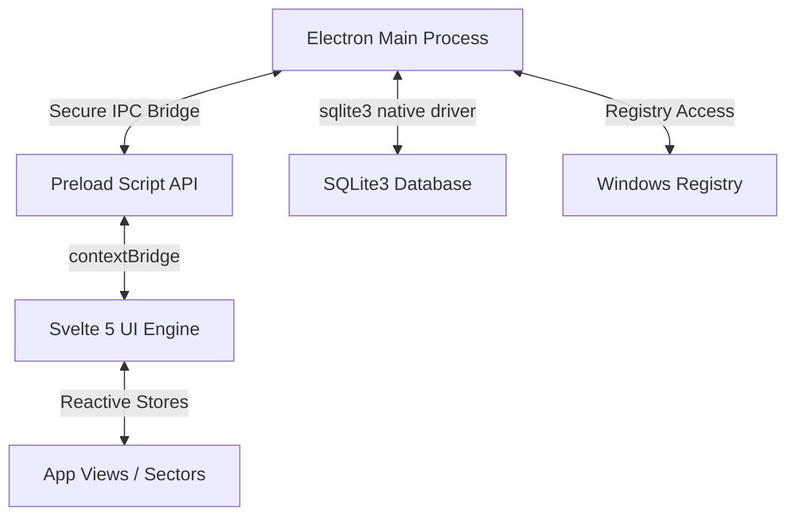

# 🌌 STRATAGEM: UI/UX DESIGN & TECHNOLOGY BLUEPRINT
> **System Architecture, Design Principles, and Technical Visual Implementation**

---

## 🛰️ 1. MISSION PURPOSE & CONCEPT
The core objective of **Stratagem** is to replace boring, flat, corporate project planners with a high-fidelity, atmospheric **Futuristic User Interface (FUI)**. The design simulates a classified tactical terminal in a neural-linked command center. 

By utilizing dark color fields, floating glass panels, physical hover elevations, and spatial audio feedback, the application transforms daily task tracking and schedule management into a gamified, high-authority strategic operation.

---

## 🎨 2. CORE VISUAL SYSTEM (THE FUI DESIGN SYSTEM)

### 🌓 Volumetric Darkness (No Flat Black)
* **Obsidian Gradients**: Never use a single flat `#000000` background. Primary containers utilize deep indigo, near-black, and dark violet gradients:
  `background: linear-gradient(180deg, rgba(13, 15, 30, 0.95) 0%, rgba(2, 2, 5, 1) 100%);`
* **Atmospheric Noise**: Subtle noise layers, holographic grid lines, and diagonal raster scanlines are composited over dark layers to make the darkness feel alive.

### 🔮 Volumetric Light & Neon Illumination
* **Glow as Structure**: Glowing lines are used to define panel contours and button states. Soft glows are generated using dual box-shadow and text-shadow filters:
  `box-shadow: 0 0 25px rgba(139, 92, 246, 0.65), inset 0 0 12px rgba(255, 255, 255, 0.15);`
* **Volumetric Glint Sweeps**: Dynamic, rotating diagonal glint lines (`.btn-liquid-sweep` and `.btn-shine-overlay`) slice across interactive buttons to simulate high-tech reflective glass.

### 🧪 Semantic Color Coding (FUI Color Dictionary)
* 🟣 **Neon Violet (Primary Intelligence)**: Represents neural sync, global active states, active tab pills, and core menu selection.
* 🔵 **Cyan / Electric Blue (Utility & Diagnostics)**: Represents databases, copy/paste cues, files, folders, and standard lock confirmations.
* 🔴 **Tactical Red (Breach & Purge)**: Represents compromised states, overdue tasks, irreversibility, system purge warnings, and close actions.
* 🟢 **Secured Emerald (Success & Stable)**: Represents completed missions, successful backups, database synchronization, and reboot triggers.

---

## 🧬 3. TECHNOLOGY MATRIX (HOW WE USE THE STACK)

### 🖥️ Electron Framework (The Hardware Wrapper)
* **Frameless Native Canvas**: Electron is configured with a frameless, non-resizable kiosk-ready window wrapper. Drag regions (`-webkit-app-region: drag`) are custom-mapped around headers to support native dragging while inputs bypass drag capture.
* **Registry Integration**: Exposes native access to Windows Registry paths (`HKCU\Software\Strategem 1.0`). Electron queries these keys on boot to mount SQLite database filepaths (`DatabasePath`) dynamically.
* **Shell Integration**: Links the frontend UI directly to the OS shell (`shell.showItemInFolder`) to open database folders in Windows Explorer.

### ⚡ Svelte 5 Compiler (The UI Engine)
* **Svelte Runes ($state, $derived, $effect)**: Leveraged for reactive data bindings. Store parameters, search filters, and priority states are bound using `$derived` runes to ensure recalculations happen at compiler speed.
* **Key-Based Animations**: Utilizes Svelte's `animate:flip` and transition engines to support physics-based shuffling on Kanban card drops and task lists.
* **DOM Culling**: Implemented conditional rendering (`{#if}`) to fully mount and unmount resource-heavy overlays (like the System Hub and Nuke Screens), preventing WebGL and backdrop filter stack limits.

### 💾 SQLite3 (The Core Memory)
* **Persistent Data Layer**: Replaces volatile memory stores with a high-speed SQLite database engine (`stratagem_intel.db`).
* **Structured Schemes**: Operates three relational tables (`config`, `missions`, `audit_log`) supporting transactional logs and automated cascade deletes on purged tasks.
* **IPC Channel Bridging**: Data queries are executed in the Node main process and bridged via pre-compiled secure channels (`db-fetch-missions`, `db-insert-mission`) to keep the Svelte UI thread lag-free.

### 🔊 Spatial Audio Engine
* **Interactive Sound Feedback**: Sound effects (e.g. system boot beep, click confirmations, card-drop clacks, and nuke alarm pulses) are triggered dynamically during interface transitions.
* **Exception Safeguard**: Audio play calls are protected by error-catching structures that log module problems to console debug files and prevent the application from crashing on systems without active sound cards.

---

## ⚡ 4. PERFORMANCE & MEMORY CONSTRAINT ARCHITECTURES

To maintain 60 FPS visual smoothness across high-resolution screens:
1. **No Backdrop Filter Stacking**: The heavy `backdrop-filter: blur(...)` style is applied only to primary overlays. Stacking multiple blurred panels is banned.
2. **Background Suspension**: When a full-screen overlay (e.g., Nuke screen or Intelligence Hub) is active, Svelte conditional blocks remove underlying pages from the DOM tree, freeing up GPU compositor tile memory.
3. **Photon Animation Cleaning**: Rotating elements (such as the Omni-Scope radars and synaptic brain nodes) suspend their CSS keyframes and intervals when hidden or minimized.
