# ♟️ STRATAGEM
> **Classified Tactical Intelligence Operating System & Mission Control Matrix**

<p align="center">
  <a href="https://github.com/karansinghverma979/Stratagem/releases/tag/v3.0.0">
    
  </a>
  
  
  
  
  <a href="LICENSE">
    
  </a>
</p>

---

> [!NOTE]
> **🏛️ FLAGSHIP SHOWCASE & REPOSITORY STATUS**:
> **Stratagem v3.0.0 is a stable, feature-complete production showcase.** Active feature development has concluded. The project remains fully maintained as an authoritative reference implementation of cinematic Futuristic User Interfaces (FUI), native SQLite Write-Ahead Logging (WAL) state machines, and hardware-accelerated Cyber-Stasis power governance on Windows 11. All 4 major version releases and standalone installers are archived and immediately downloadable below.

---

<p align="center">
  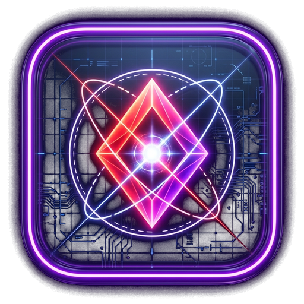
</p>

<div align="center">

### 🚀 GET STRATAGEM (STANDALONE INSTALLER)

[-8A2BE2?style=for-the-badge&logo=windows&logoColor=white)](https://github.com/karansinghverma979/Stratagem/releases/download/v3.0.0/Stratagem-3.0.0-setup.exe)
[](https://github.com/karansinghverma979/Stratagem/releases/tag/v3.0.0)

**1-Line PowerShell Auto-Download & Install:**
```powershell
irm https://github.com/karansinghverma979/Stratagem/releases/download/v3.0.0/Stratagem-3.0.0-setup.exe -OutFile Stratagem-Setup.exe; .\Stratagem-Setup.exe
```

</div>

---

## ⚡ 5-Second System Architecture Card

```text
┌────────────────────────────────────────────────────────────────────────┐
│                   STRATAGEM v3.0 TACTICAL HUD MATRIX                   │
├───────────────────┬───────────────────┬────────────────────────────────┤
│  EXECUTION MATRIX │  ARSENAL KANBAN   │        CHRONOS SECTOR          │
│  • Active Missions│  • Raw Intel      │  • Unified Clock (12h/24h)     │
│  • Threat Ratings │  • Synthesizing   │  • Circular Target Lock Ring   │
│  • Regex Filters  │  • Task Forge IPC │  • CRT Scanline Mini-HUD       │
├───────────────────┼───────────────────┼────────────────────────────────┤
│  BREACH SYSTEM    │  ARCHIVE HUB      │        GENESIS CONFIG          │
│  • Alarm Vignette │  • Chronicles     │  • Cyber-Stasis (Ctrl+Alt+S)   │
│  • Threat Mitig.  │  • Decrypt Reveal │  • NoteCards / Avatar Gauges   │
│  • Instant Purge  │  • Victory Badges │  • Fast Cold Boot (<200ms)     │
├───────────────────┴───────────────────┴────────────────────────────────┤
│  CORE STACK: Electron Native Shell • Svelte 5 Runes • SQLite3 (WAL Mode)│
└────────────────────────────────────────────────────────────────────────┘
```

---

## 🎯 Mission Purpose & The 5 Tactical Operating Rules

### Why Stratagem Exists: The Antidote to Boring Web Checklists
Most project trackers (Trello, Jira, Todoist, Notion) suffer from three fatal flaws:
1. **Dull, Uninspiring Interfaces**: Spreadsheet-like web layouts that feel like corporate homework rather than mission command.
2. **Cloud Vulnerability & Subscription Bloat**: Private thoughts, goals, and strategies are hosted on remote servers, subject to downtime, rate limits, and recurring fees.
3. **Subconscious Distraction & Battery Drain**: Heavy browser DOMs, unconstrained CPU loops, and a complete absence of urgency when deadlines pass.

**Stratagem is the antithesis**: A cinematic **Futuristic User Interface (FUI)** tactical command console designed to turn your screen into a high-stakes mission bridge. It bridges military-grade execution discipline with gamified cybernetic aesthetics, zero cloud dependencies, and instant local hardware responsiveness.

```text
┌────────────────────────────────────────────────────────────────────────┐
│                    THE 5 IMMUTABLE TACTICAL RULES                      │
├────┬─────────────────────────────┬─────────────────────────────────────┤
│ 01 │ Sovereign Persistence       │ 100% Local SQLite3 WAL. Zero cloud, │
│    │                             │ zero telemetry, zero accounts.       │
├────┼─────────────────────────────┼─────────────────────────────────────┤
│ 02 │ Deep Focus (Cyber-Stasis)   │ Press Ctrl+Alt+S or minimize to drop│
│    │                             │ CPU & GPU load to 0.0% instantly.   │
├────┼─────────────────────────────┼─────────────────────────────────────┤
│ 03 │ Breach Accountability       │ Deadlines are rigid. Missed dates   │
│    │                             │ trigger pulsing red breach alarms.  │
├────┼─────────────────────────────┼─────────────────────────────────────┤
│ 04 │ Weaponized Progression      │ Ideas enter as Raw Intel, synthesize│
│    │                             │ in Kanban, and forge as Missions.   │
├────┼─────────────────────────────┼─────────────────────────────────────┤
│ 05 │ Zero-Latency Velocity       │ Complete workflows execute without a│
│    │                             │ mouse via J/K, Space, and Enter.    │
└────┴─────────────────────────────┴─────────────────────────────────────┘
```

---

### 🌐 Primary Real-World Use Cases

* **⚔️ High-Stakes Exam & Certification Sprints (SSC, UPSC, Engineering, Medical)**:
  Transform sprawling syllabus modules into time-bounded missions. Track historical mock percentiles, enforce daily Pomodoro lock-ins with the circular target timer, and eliminate procrastination through high-stakes visual accountability.
* **💻 Systems & Indie Game Engineering**:
  An offline mission bridge running borderless on a secondary vertical or ultrawide monitor. Map architecture refactors across the 3-tier Arsenal board and monitor commits with CRT scanline aesthetics.
* **⚡ Workshop Fabrication & Hardware Prototyping**:
  Track electrical motor rewinding, PCB soldering, or machining runs step-by-step with audible mechanical click confirmations and clear task resolution badges (`VICTORY` vs `ABORTED`).
* **🧠 Executive Deep Work & Distraction Shield**:
  Combine customizable ambient audio soundscapes with floating holographic mini-timers to enter and sustain multi-hour flow states without switching browser tabs.

---

### 🗣️ Demystifying the Military Lexicon: Plain English Translation

While Stratagem utilizes high-immersion military intelligence terminology, its operational engine translates directly into standard productivity concepts:

| Cinematic FUI Term | Plain English Equivalent | Everyday Productivity Utility |
| :--- | :--- | :--- |
| **Missions** | High-Priority Projects & Tasks | Actionable deliverables with measurable outcomes and subtasks. |
| **Threat Ratings** | Priority Hierarchy (Low / Med / High) | Immediate visual color triage to focus on urgent blockers first. |
| **Temporal Boundary** | Hard Due Date & Deadline | Strict completion boundaries enforced by countdown algorithms. |
| **Arsenal Sector** | 3-Tier Kanban Board | Structured pipeline: `Raw Intel` ──► `Synthesizing` ──► `Weaponized`. |
| **Breach Sector** | Overdue Quarantine Dashboard | Automatic red-alert quarantine forcing immediate resolution of overdue tasks. |
| **Chronos Sector** | Pomodoro Focus Engine | Distraction-free countdown ring with audio target-lock notifications. |
| **Critical Purge** | Factory Reset / Clean State | One-click failsafe database purge to reset your workstation environment. |
| **Genesis Sector** | System Settings & Configurations | UI blur governors, audio synthesizer controls, and data backup portals. |

---

## ⚡ The Architectural Evolution: Passing the Torch to Campaigns

> **"Stratagem proved that desktop software can be a visual masterpiece. Campaigns proved how fast it can fly."**

Stratagem is an engineering monument—it pushed the boundaries of what is possible with Svelte 5, Electron, Web Audio API, and volumetric glassmorphism. However, extreme visual richness introduces physical hardware constraints:
* **The Resource Equation**: Rendering 24 simultaneous holographic viewports, backdrop blurs, audio oscillators, and custom shaders requires significant GPU VRAM and 300 MB–800 MB RAM.
* **The Transition Decision**: While optimizations like the **Cyber-Stasis Protocol** successfully eliminated idle draw, active daily execution demanded an ultra-lean, whisper-quiet system footprint.

```text
┌───────────────────────────────────────────┬───────────────────────────────────────────┐
│ ♟️ STRATAGEM (The Visual Monument)        │ ⚡ CAMPAIGNS (The Lightweight Daily Driver) │
├───────────────────────────────────────────┼───────────────────────────────────────────┤
│ • Peak Cinematic FUI Frontend Artistry    │ • Zero-Latency High-Velocity Execution    │
│ • 24 Volumetric Glassmorphic Sectors      │ • Lean, Focused Minimalist Viewports      │
│ • Rich Web Audio Acoustic Oscillators     │ • Whisper-Quiet System Footprint          │
│ • Standalone SQLite3 Kiosk Shell          │ • Native Bidirectional Obsidian Markdown  │
│ • Resource Profile: Heavy GPU/VRAM & RAM  │ • Resource Profile: Ultra-Low Idle RAM/CPU│
│ • Status: Feature-Complete Flagship Build │ • Status: Active Primary Daily Driver     │
└───────────────────────────────────────────┴───────────────────────────────────────────┘
```

Therefore, active development has shifted to **[Campaigns](https://github.com/karansinghverma979/Campaigns)**—a streamlined, zero-latency tactical task manager built for low system resources, minimal memory footprints, and bidirectional synchronization with local **Obsidian Markdown Vaults**.

* **Want the cinematic FUI showpiece?** Run **[Stratagem](https://github.com/karansinghverma979/Stratagem)** below.
* **Want the ultra-lightweight daily driver?** Discover **[Campaigns](https://github.com/karansinghverma979/Campaigns)**.
* *(Read the full engineering retrospective in **[EVOLUTION.md](EVOLUTION.md)**).*

## 📦 Production Release Matrix & Version Heritage

All 4 major releases of Stratagem are permanently preserved with direct standalone installer downloads:

| Release | Version Tag | Standalone Installer (.exe) | Asset Size | Primary Architectural Milestone |
| :--- | :--- | :--- | :--- | :--- |
| **v3.0.0** | [`v3.0.0`](https://github.com/karansinghverma979/Stratagem/releases/tag/v3.0.0) | [Stratagem-3.0.0-setup.exe](https://github.com/karansinghverma979/Stratagem/releases/download/v3.0.0/Stratagem-3.0.0-setup.exe) | **783 MB** | **Cyber-Stasis Protocol (`Ctrl+Alt+S`)**: 0.0% CPU / 0% GPU sleep mode; Battery-Aware Stealth HUD; Vim-style `J`/`K`/`Enter`/`Space` nav; Fast Cold Boot (<200ms). |
| **v2.3.0** | [`v2.3.0`](https://github.com/karansinghverma979/Stratagem/releases/tag/v2.3.0) | [Stratagem-2.3.0-setup.exe](https://github.com/karansinghverma979/Stratagem/releases/download/v2.3.0/Stratagem-2.3.0-setup.exe) | **783 MB** | **Milestone Engagement Ratio (1440 : 60)**; 0ms non-blocking Genesis sector navigation; UTC timezone integrity engine; SQLite WAL exit checkpointing. |
| **v2.0.0** | [`v2.0.0`](https://github.com/karansinghverma979/Stratagem/releases/tag/v2.0.0) | [Stratagem-2.0.0-setup.exe](https://github.com/karansinghverma979/Stratagem/releases/download/v2.0.0/Stratagem-2.0.0-setup.exe) | **452 MB** | **Cosmic Containment**: Svelte `{#if}` conditional sector unmounting (-60% idle RAM); SQLite WAL Mode (5x faster concurrency); non-blocking async IPC file I/O. |
| **v1.0.1** | [`v1.0.1`](https://github.com/karansinghverma979/Stratagem/releases/tag/v1.0.1) | [Stratagem-1.0.1-setup.exe](https://github.com/karansinghverma979/Stratagem/releases/download/v1.0.1/Stratagem-1.0.1-setup.exe) | **452 MB** | **Initial Production Release**: 24-sector FUI tactical mission control suite; local SQLite persistence; custom NSIS installer; glassmorphic HUD. |

---

## 🚀 Quickstart & Installation Guide

Stratagem provides two distinct onboarding pathways depending on whether you are an operator seeking the standalone application or an engineer looking to inspect the source code.

---

### 🔰 Pathway 1: For Operators & Non-Technical Users (1-Click Setup)

> [!IMPORTANT]
> **Zero Technical Prerequisites**: You do **NOT** need Node.js, Python, Git, or C++ compilers installed. Everything is pre-compiled into a single self-contained Windows application.

```text
┌──────────────────────────┬─────────────────────────────────────────────────┐
│ MINIMUM SYSTEM SPECS     │ RECOMMENDED OPERATIONAL SPECS                   │
├──────────────────────────┼─────────────────────────────────────────────────┤
│ OS: Windows 10 / 11 64-bit│ OS: Windows 11 (Version 22H2 or higher, x64)   │
│ RAM: 4 GB                │ RAM: 8 GB or higher                             │
│ Storage: 1.2 GB free space│ Display: 1080p, 1440p, or 4K Ultrawide         │
│ GPU: Integrated Graphics │ Audio: Headphones or stereo speakers (FUI audio)│
└──────────────────────────┴─────────────────────────────────────────────────┘
```

#### Option A: Direct GUI Installer Wizard (Recommended)
1. Download the official production build: **[Stratagem-3.0.0-setup.exe](https://github.com/karansinghverma979/Stratagem/releases/download/v3.0.0/Stratagem-3.0.0-setup.exe)** *(783 MB, SHA-256 verified)*.
2. Double-click the `.exe` file to launch the **NSIS Tactical Setup Wizard**.
3. Choose your destination directory (default: `%LOCALAPPDATA%\Programs\Stratagem`) and select whether to create a Desktop shortcut.
4. Click **Install**. The setup wizard automatically registers file associations and configures local SQLite storage.
5. Click **Finish** to cold-boot into the Stratagem Mission Control Matrix!

#### Option B: 1-Line PowerShell Auto-Installer
Open Windows PowerShell and paste this single command to download and launch the installer automatically:
```powershell
irm https://github.com/karansinghverma979/Stratagem/releases/download/v3.0.0/Stratagem-3.0.0-setup.exe -OutFile Stratagem-Setup.exe; .\Stratagem-Setup.exe
```

---

### 🛠️ Pathway 2: For Engineers & Developers (Source Build & Extension)

Follow this pathway to audit the source code, customize the Svelte 5 sectors, or compile custom binaries.

#### 1. System Requirements & Toolchain
* **Node.js**: `v18.x` or `v20.x` LTS
* **Package Manager**: `npm v9+` or `pnpm`
* **Native C++ Compiler** (Required for native `sqlite3` addon compilation):
  * **Windows**: Visual Studio Community (with *"Desktop Development with C++"* workload) OR run `npm install --global windows-build-tools` from an elevated PowerShell.
  * **Linux**: `sudo apt install build-essential python3`
  * **macOS**: `xcode-select --install`

#### 2. Local Environment Bootstrapping
```bash
# 1. Clone the repository from GitHub
git clone https://github.com/karansinghverma979/Stratagem.git
cd Stratagem

# 2. Install dependencies & rebuild native SQLite3 drivers for Electron
npm install
npm run postinstall

# 3. Launch with Vite hot-reloading dev server & Electron shell
npm run dev
```

#### 3. Production Packaging Targets
```bash
# Compile standalone Windows setup installer (Output: dist/Stratagem-3.0.0-setup.exe)
npm run build:win

# Compile unpacked portable folder (Output: dist/win-unpacked/)
npm run build:unpack

# Compile macOS or Linux distribution packages
npm run build:mac
npm run build:linux
```

*(For comprehensive directory blueprints, IPC ContextBridge contracts, and sector extension guides, consult **[GUIDE.md](GUIDE.md)** and **[INFO.md](INFO.md)**).*

---

## 🧭 Interactive 24-Sector Operator Directory

Quick-jump directly to the visual documentation and telemetry specs for any operational sector:

| Sector / Module | Sector / Module | Sector / Module | Sector / Module |
| :--- | :--- | :--- | :--- |
| [0. Boot Sequence](#0-system-boot-sequence-cold-boot-loading-screen) | [1. Critical Purge](#1-critical-purge-console-nuke-storage-protocol) | [2. Database Integrity](#2-database-integrity-station-system-backup-matrix) | [3. Neural Link Station](#3-neural-link-station-diagnostics-feed-console) |
| [4. Forge Station](#4-forge-station-task-forge-modal) | [5. Temporal Nexus](#5-temporal-nexus-forge-calendar-engine) | [6. Mission Protocol](#6-mission-protocol-modal-execution-task-view) | [7. Victory/Abort Badges](#7-victory--abort-badges-mission-resolutions) |
| [8. Arsenal Sector](#8-arsenal-sector-strategic-kanban-board) | [9. Raw Intel & Kanban](#9-raw-intel--synthesizing-kanban-columns) | [10. Calibration Filters](#10-calibration-station-telemetry-filters--sorting) | [11. Breach Sector](#11-breach-sector-alarm-dashboard) |
| [12. Breach Task View](#12-breach-task-view-compromise-details-modal) | [13. Realignment Dials](#13-realignment-station-mitigation-dials) | [14. Chronos Sector](#14-chronos-sector-focus-sync-station) | [15. Chronos Focus Timer](#15-chronos-focus-timer-target-lock-progress-ring) |
| [16. Chronos Todo](#16-chronos-todo-auxiliary-task-checklists) | [17. Chronos Reminders](#17-chronos-reminders-operational-alarms) | [18. Chronos Stopwatch](#18-chronos-stopwatch-diagnostic-dial) | [19. Genesis Sector](#19-genesis-sector-central-configuration-panel) |
| [20. Developer Portraits](#20-developer-portraits-panel-devimages-configuration) | [21. Mental Skills](#21-mental-skills-cognitive-improvement-nodes) | [22. NoteCards Flashcards](#22-notecards-cognitive-flashcard-portal) | [23. Environment Toggles](#23-environment-settings-system-toggles) |
| [24. Improvement Matrix](#24-integrated-improvement-matrix-neural-uplink-logs) | — | — | — |

---

## 🛠️ CORE SYSTEM COMPONENT DOCUMENTATION

### 0. SYSTEM BOOT SEQUENCE (Cold Boot Loading Screen)

<p align="center">
  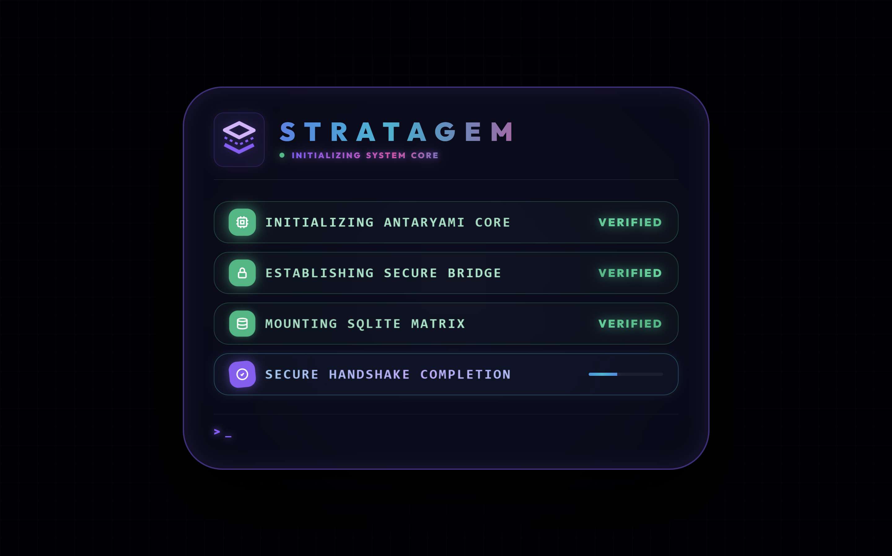
</p>

* **UI & Aesthetics**: A dark, full-screen holographic terminal overlay. Employs a scrolling diagnostics log printing hexadecimal address blocks, loading status indicators, and system checks. Features an oversized header reading `SYSTEM BOOT SEQUENCE` with a shimmering neon gradient pulse and high-contrast typography.
* **Function & Abilities**: Plays the `cold-boot` console chime on mount. Runs a sequential initialization loop checking Electron IPC connections, querying registry portals, and mounting the SQLite database. Once complete, it executes a Svelte transition fade-out to reveal the main workspace.

---

### 1. CRITICAL PURGE CONSOLE (Nuke Storage Protocol)

<p align="center">
  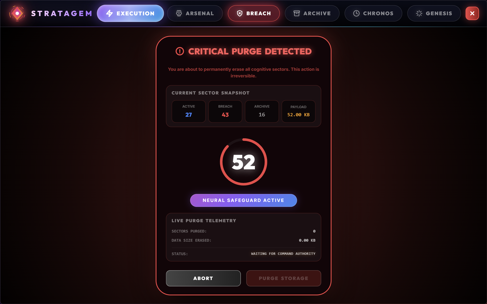
</p>

* **UI & Aesthetics**: High-intensity Tactical Red glassmorphic full-screen overlay. Includes a neon-glowing 60-second circular progress countdown SVG, a diagonal scrolling caution safeguard tape animation, and a real-time data table showing active system snapshots. The container is subject to a kinetic vibration effect (`dumpShake` keyframe loop) when active.
* **Function & Abilities**: A lock-out screen that suspends all other UI interactions. Once authorized, it initiates a complete transactional database purge, deleting all rows in `missions` and `audit_log`, resetting configs, and displaying a Cyan-themed `SYSTEM REBOOT` controller to reinitialize the empty database workspace.

---

### 2. DATABASE INTEGRITY STATION (System Backup Matrix)

<p align="center">
  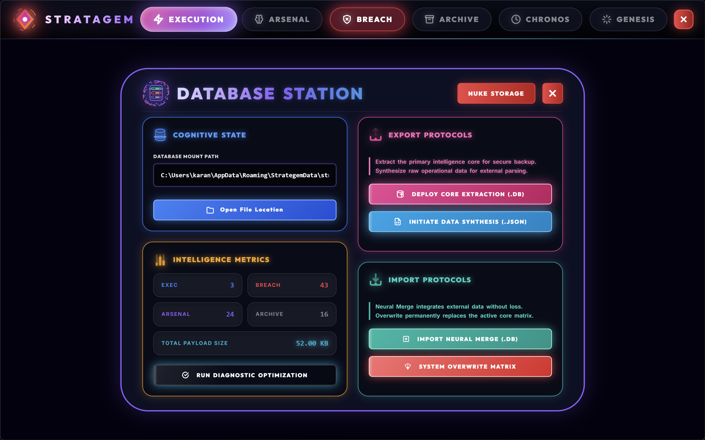
</p>

* **UI & Aesthetics**: Located inside the Intelligence Hub modal, styled with glowing emerald and cyan borders. Features database path readouts with a pen-and-paper SVG cursor hover effect, and diagnostic progress bars.
* **Function & Abilities**: Links the user to native Windows shell functions to open the database filepath directly in Windows Explorer. Contains triggers for local `.db` binary exporting and JSON config backups, showing stateful color indicators (orange for processing, green for success, red for failures) and displaying holographic copy notifications.

---

### 3. NEURAL LINK STATION (Diagnostics Feed Console)

<p align="center">
  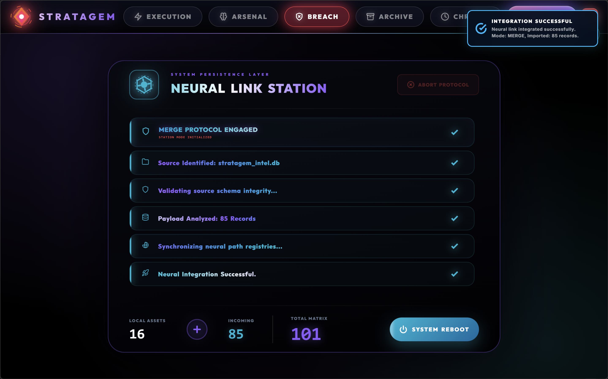
</p>
<br>
<p align="center">
  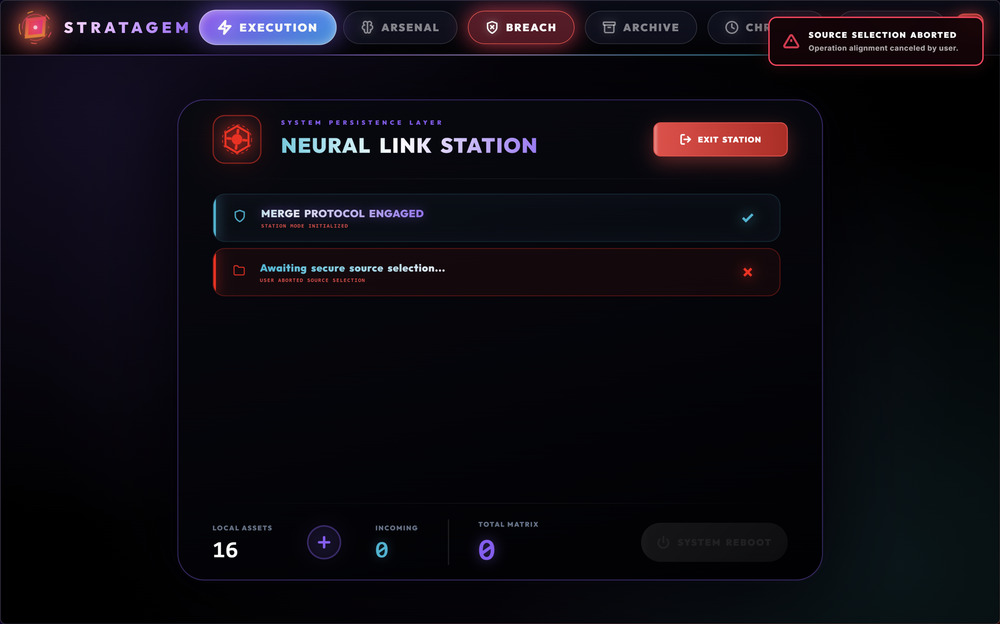
</p>
<br>
<p align="center">
  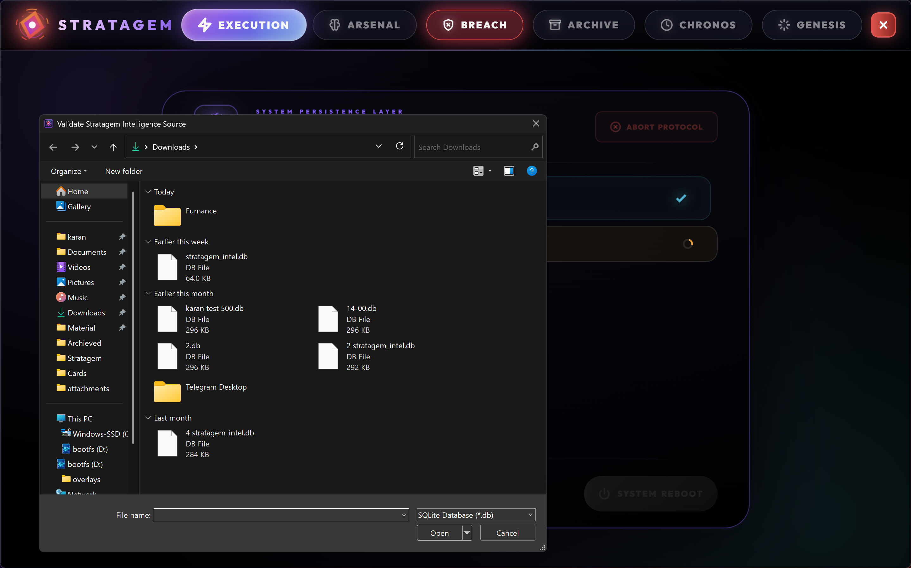
</p>

* **UI & Aesthetics**: A vertically layout terminal console streaming simulated cybernetic synchronization telemetry logs. Uses mono-spaced font weights, dotted data matrices, and active checking marks.
* **Function & Abilities**: Handles custom configuration file imports. Displays real-time validation checks for uploaded data schemas. If a file is successfully parsed, it triggers store syncs and plays the `success-ping` sound; otherwise, it highlights structural syntax errors in red.

---

### 4. FORGE STATION (Task Forge Modal)

<p align="center">
  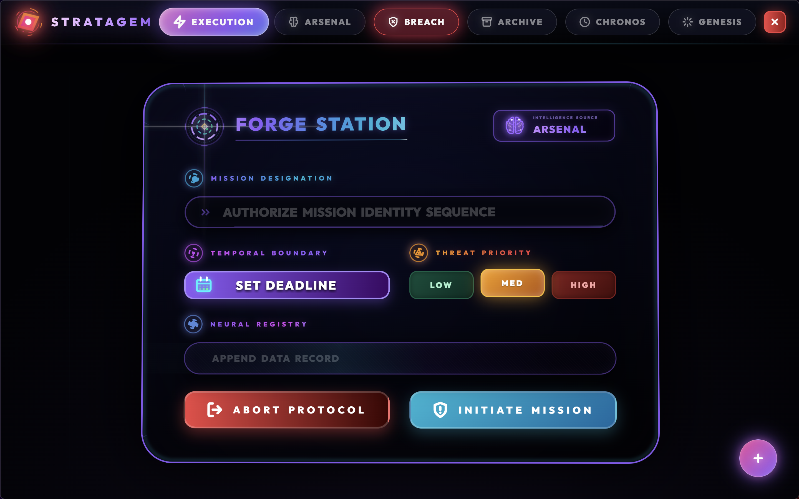
</p>

* **UI & Aesthetics**: A prominent modal overlay (spanning 75vw) featuring a 3D glassmorphic panel, high-contrast inputs, and a target validation telemetry card on the top right. Displays the primary **Omni-Scope v6.0** targeting reticle.
* **Function & Abilities**: The central command window for adding new missions. Operator inputs are dynamically validated for length and characters. Provides priority selectors, tactical tags configurations, and integrates the temporal date scheduler, writing entries directly into SQLite.

---

### 5. TEMPORAL NEXUS (Forge Calendar Engine)

<p align="center">
  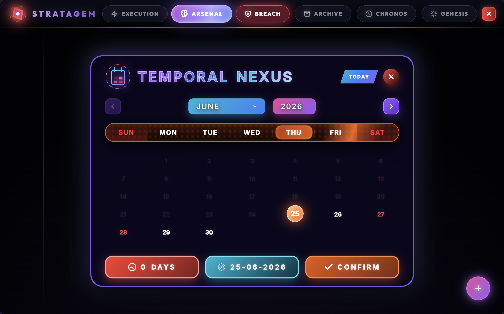
</p>

* **UI & Aesthetics**: A 500px circular grid layout representing dates, styled with thin glowing lines, month/year selector dropdown menus, and neon indicators.
* **Function & Abilities**: A custom-coded calendar calendar grid utilizing timezone arithmetic and leap-year calculations. Blocks selection of past dates, highlights target dates in neon cyan, and outputs selected date captures back to the parent Forge modal.

---

### 6. MISSION PROTOCOL MODAL (Execution Task View)

<p align="center">
  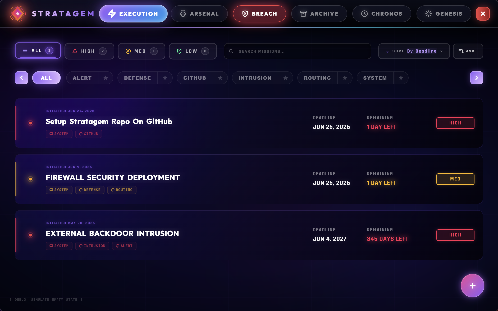
</p>
<br>
<p align="center">
  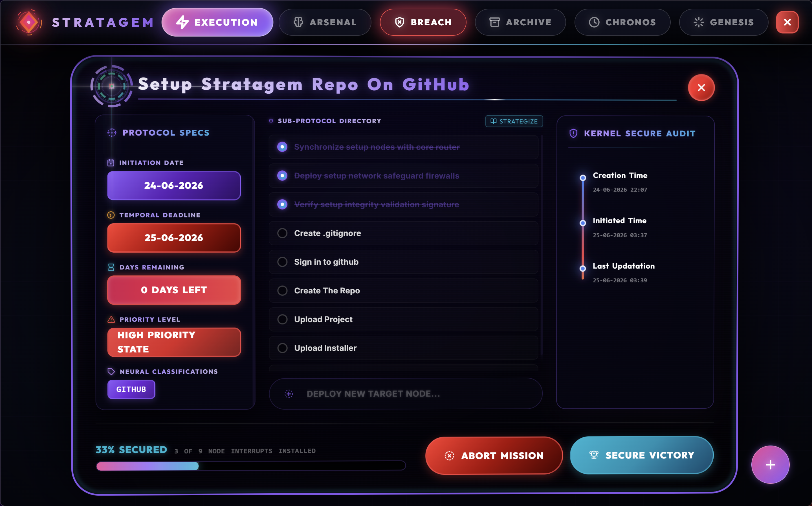
</p>

* **UI & Aesthetics**: Oversized overlay (85vw width by 80vh height) featuring a 48px padding layout, deep backdrop blurs, and high-visibility typography (Outfit headers scaled to 2.5rem).
* **Function & Abilities**: Displays comprehensive parameters for a single mission. Houses sub-mission checkbox registries, threat adjustment dials, and outputs a scrolling chronological timeline log (`audit_log` table) detailing every state change the mission has undergone.

---

### 7. VICTORY / ABORT BADGES (Mission Resolutions)

<p align="center">
  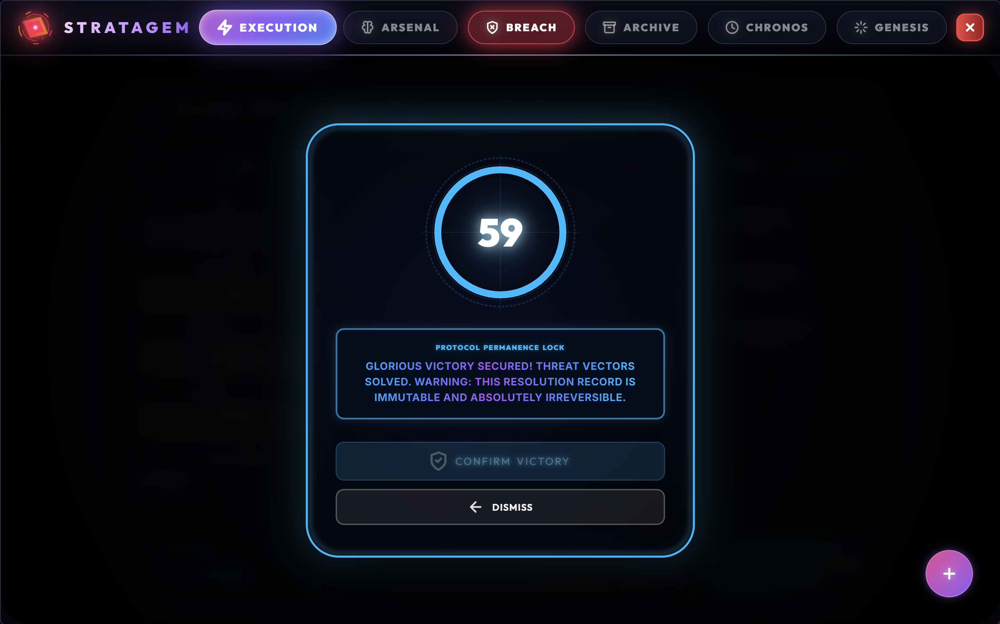
</p>
<br>
<p align="center">
  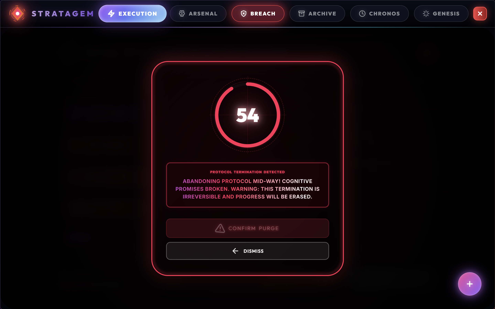
</p>

* **UI & Aesthetics**: Saturated neon badges embedded on historical rows. Completed missions display a glowing emerald badge marked `VICTORY`, while terminated ones display a crimson `ABORTED` badge.
* **Function & Abilities**: Clicking a completed or aborted mission badge locks edit capabilities (sets `readOnly` to true) and loads their corresponding resolution comments.

---

### 8. ARSENAL SECTOR (Strategic Kanban Board)

<p align="center">
  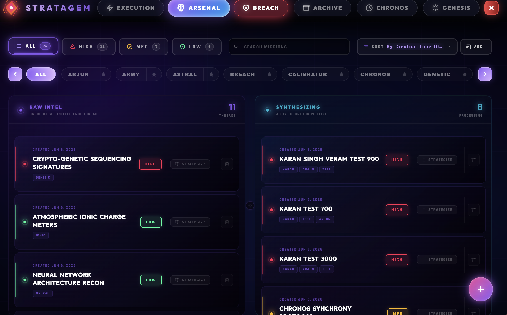
</p>

* **UI & Aesthetics**: Three-column tactical grid layout using Outfit headers and glowing volumetric borders. Column backdrops feature glassmorphic blurs.
* **Function & Abilities**: A Kanban planning system mapping the phases of project setup. Supports fluid HTML5 drag-and-drop actions, shuffling cards smoothly with Svelte `animate:flip`, and updating database states reactively on drop.

---

### 9. RAW INTEL & SYNTHESIZING (Kanban Columns)

<p align="center">
  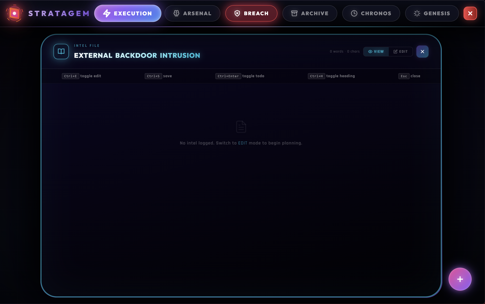
</p>

* **UI & Aesthetics**: Raw Intel column uses cyan border accents (Utility), representing unprocessed inputs. Synthesizing uses neon-violet highlights (Sync), representing tasks undergoing detail compilation.
* **Function & Abilities**: Serves as the pre-execution planning ground. Cards dragged between these columns execute instant database update promises without locking the main UI thread.

---

### 10. CALIBRATION STATION (Telemetry Filters & Sorting)

<p align="center">
  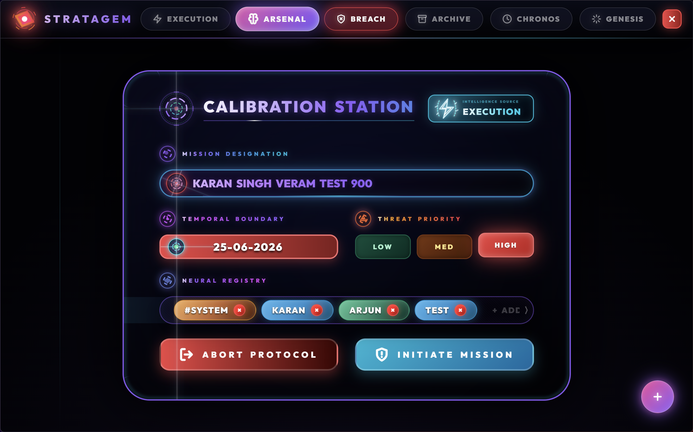
</p>

* **UI & Aesthetics**: Expansive, 100% wide horizontal filter bar positioned directly below the top navigation. Designed with glassmorphic blurs, solid checkmark icons, and threat selection tabs.
* **Function & Abilities**: Enables real-time, non-blocking sorting and filtering of active missions. Evaluates sorting criteria (e.g., sort by deadline, alphabetically, or date created) and filters based on text match inputs.

---

### 11. BREACH SECTOR (Alarm Dashboard)

<p align="center">
  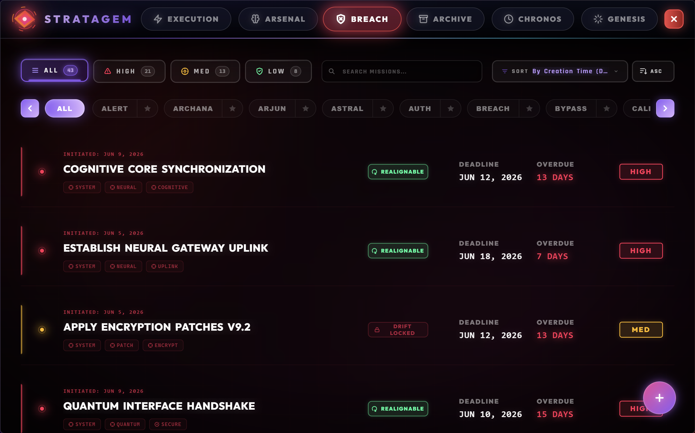
</p>

* **UI & Aesthetics**: Wrapped inside a pulsing **Tactical Red** vignette glow, showcasing stuttering color-split glitch text headers, representing system alarms.
* **Function & Abilities**: Pulls all missions from the database where deadlines have passed or parameters are compromised. Keeps a persistent badge notification in the top bar navigation showing compromise counts.

---

### 12. BREACH TASK VIEW (Compromise Details Modal)

<p align="center">
  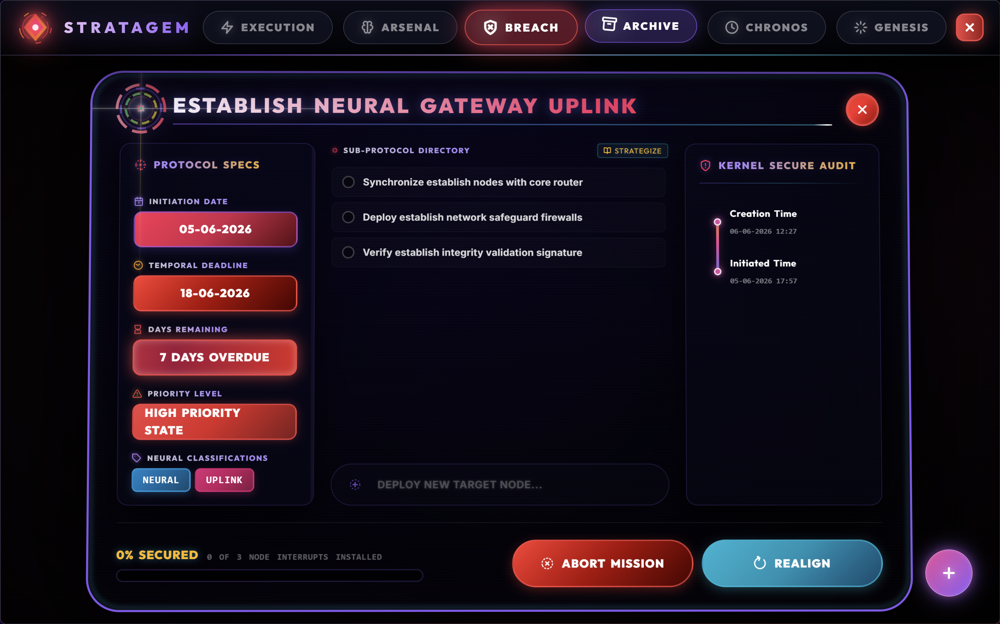
</p>

* **UI & Aesthetics**: Centered overlay modal styled with red alarm borders and scrolling diagnostic metadata telemetry logs.
* **Function & Abilities**: Isolate a compromised task, inspect security breach timestamps, and determine why the system flagged the parameters.

---

### 13. REALIGNMENT STATION (Mitigation Dials)

<p align="center">
  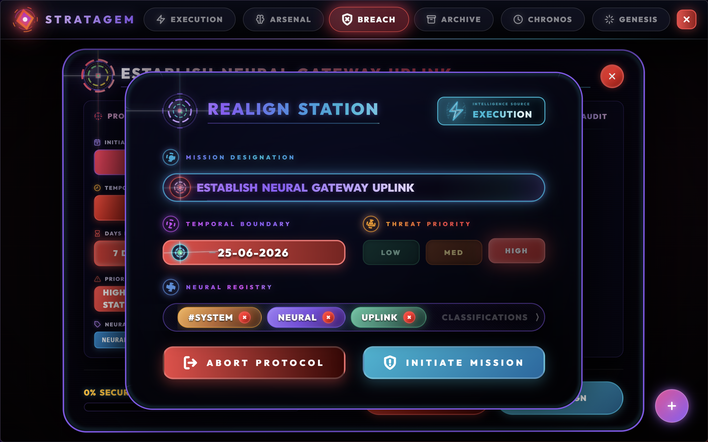
</p>

* **UI & Aesthetics**: Inline interactive buttons with glowing hover states.
* **Function & Abilities**: Initiates realignment for breached tasks. Allows the operator to immediately assign new temporal boundaries (dates), lower threat levels to clear alerts, or trigger system purge overrides.

---

### 14. CHRONOS SECTOR (Focus Sync Station)

<p align="center">
  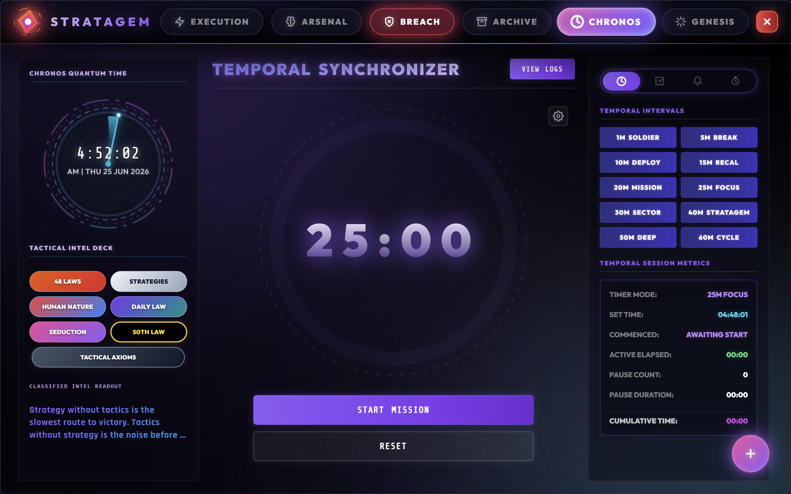
</p>

* **UI & Aesthetics**: Volumetric console featuring a central countdown timer, circular progress SVG rings, and side-aligned command panels.
* **Function & Abilities**: Handles temporal synchronization routines, combining Pomodoro timers, scheduled reminder notifications, stopwatch tracking, and todo logs.

---

### 15. CHRONOS FOCUS TIMER (Target Lock Progress Ring)

<p align="center">
  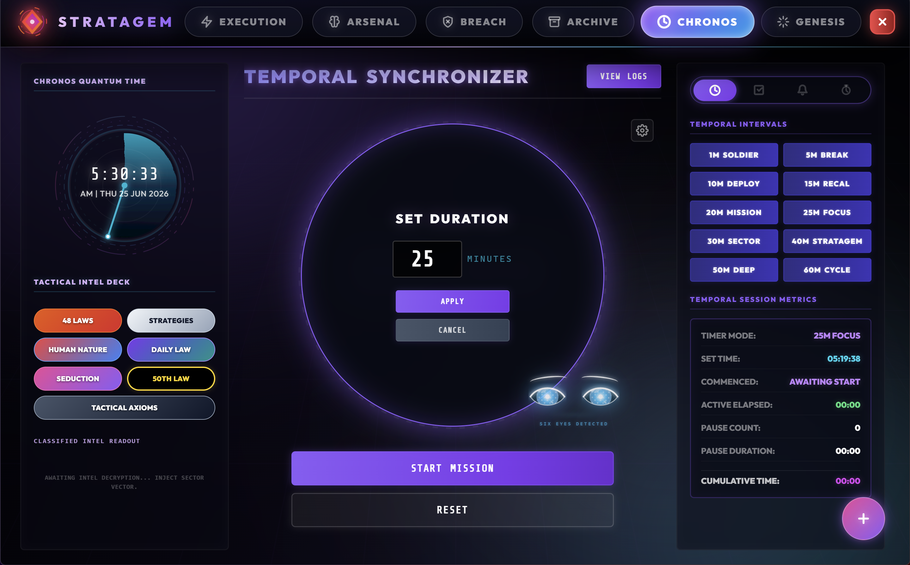
</p>

* **UI & Aesthetics**: SVG neon-purple circular progress ring. When active, it displays target lock animations.
* **Function & Abilities**: A focus timer countdown. Once the timer reaches zero, it plays target lock alarms, resets state blocks, and records the session count.

---

### 16. CHRONOS TODO (Auxiliary Task Checklists)

<p align="center">
  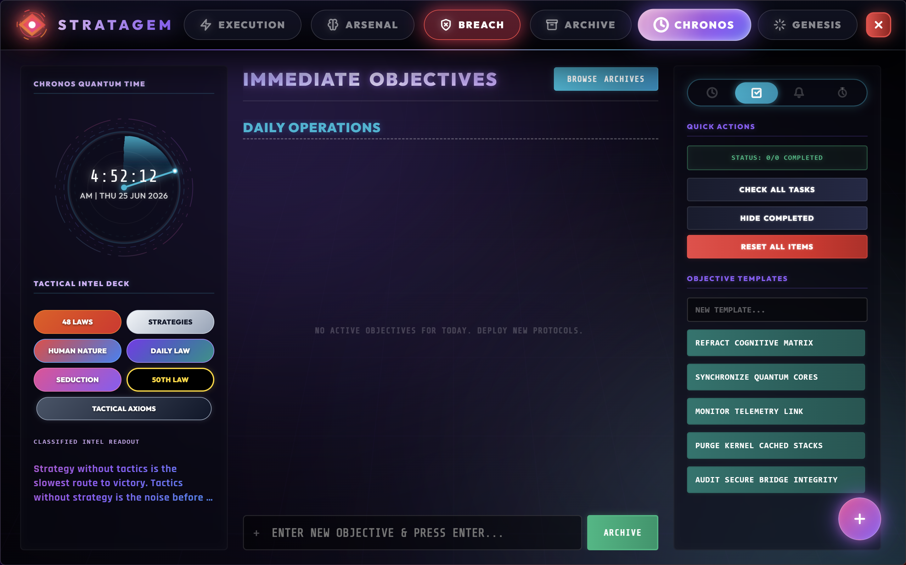
</p>

* **UI & Aesthetics**: A scrolling sidebar list with hollow checkbox indicators, green completion strikes, and thin borders.
* **Function & Abilities**: Handles minor, short-term tasks that don't require full Forge authorization. Stores checklist items inside the configuration store.

---

### 17. CHRONOS REMINDERS (Operational Alarms)

<p align="center">
  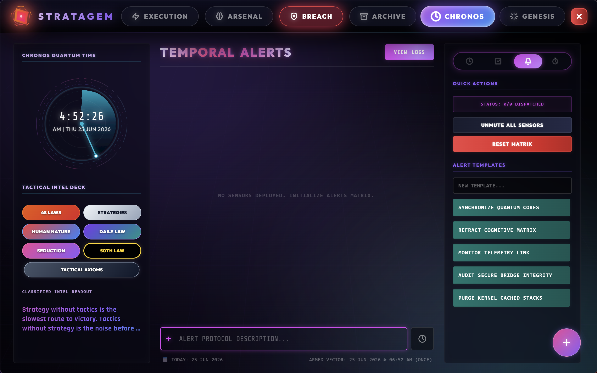
</p>
<br>
<p align="center">
  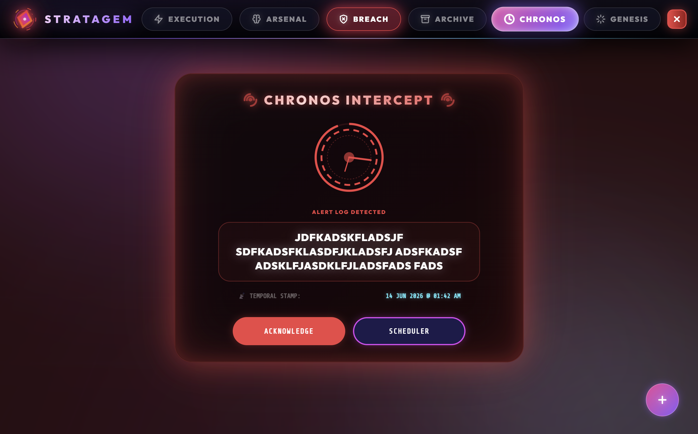
</p>

* **UI & Aesthetics**: Grid cells showing time readouts, notification badges, and delete triggers.
* **Function & Abilities**: Allows scheduled time alarms. Once a reminder time is reached, it triggers the global Shield notification engine to display alerts.

---

### 18. CHRONOS STOPWATCH (Diagnostic Dial)

<p align="center">
  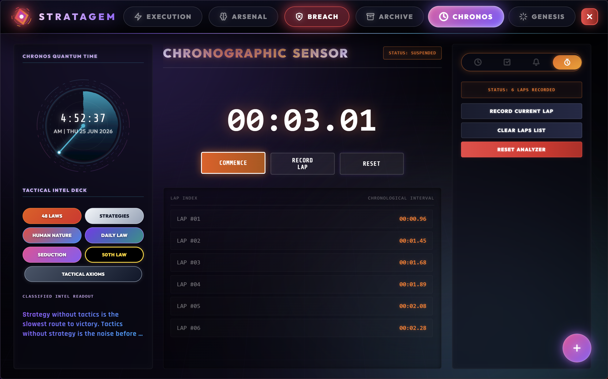
</p>

* **UI & Aesthetics**: A secondary digital layout console displaying milliseconds readouts.
* **Function & Abilities**: Acts as a simple stopwatch tool for timing diagnostic operations.

---

### 19. GENESIS SECTOR (Central Configuration Panel)

<p align="center">
  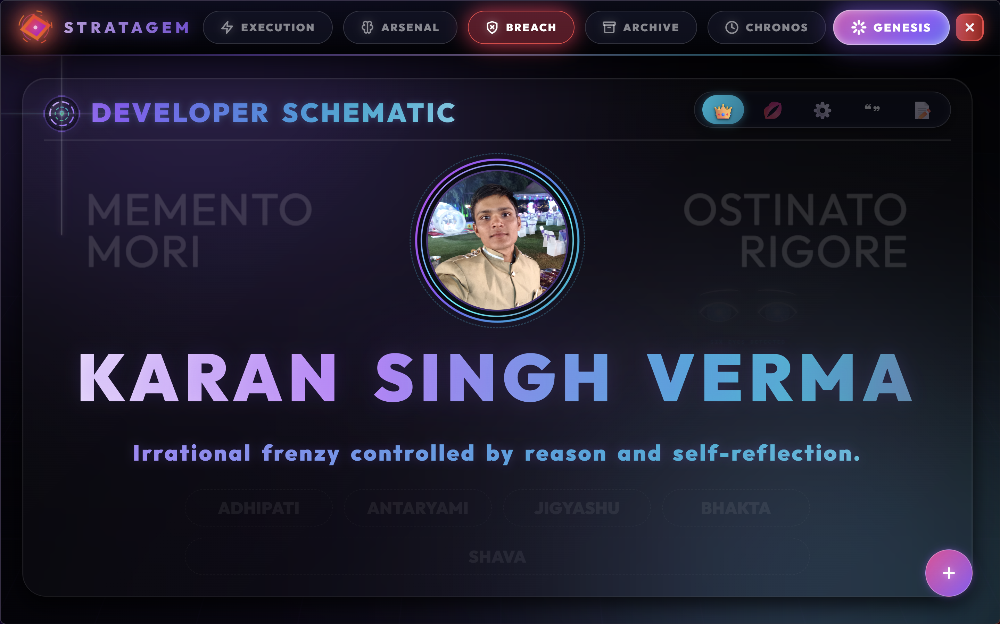
</p>

* **UI & Aesthetics**: Modular glassmorphic settings panel with neon violet accent sliders, toggle checkboxes, and diagnostic telemetries.
* **Function & Abilities**: The central command node to toggle companion modes, manage file directory paths (devImages, NoteCards, DB), and configure sound card diagnostics.

---

### 20. DEVELOPER PORTRAITS PANEL (devImages Configuration)

<p align="center">
  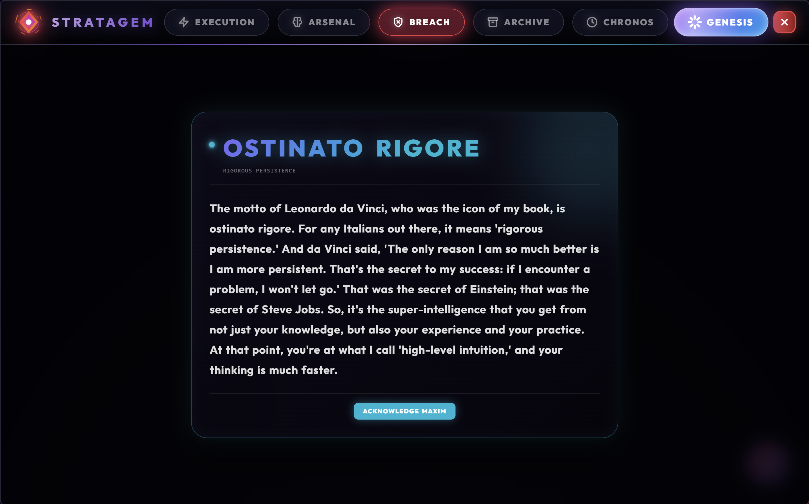
</p>

* **UI & Aesthetics**: Slide-out panel loading developer portrait grids, custom images, and telemetry data tables.
* **Function & Abilities**: Registers the directory portal path for developer portrait folders. Reads custom image files and updates the visual interface maps.

---

### 21. MENTAL SKILLS (Cognitive Improvement Nodes)

<p align="center">
  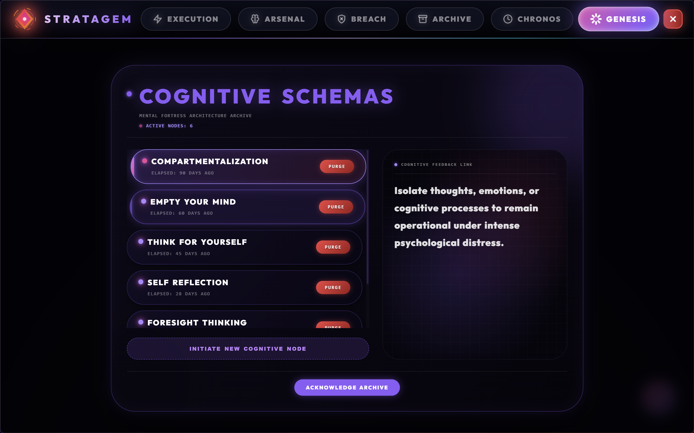
</p>

* **UI & Aesthetics**: Interactive node network grid (skill tree) displaying connected cognitive and operational nodes.
* **Function & Abilities**: Allows tracking personal goals and cognitive progression. Clicking nodes displays operational requirements and unlock statuses.

---

### 22. NOTECARDS (Cognitive Flashcard Portal)

<p align="center">
  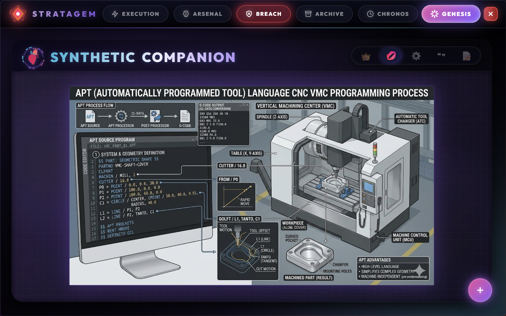
</p>

* **UI & Aesthetics**: High-contrast card slides featuring text matrices, study logs, and next/previous button readouts.
* **Function & Abilities**: A diagnostic study tool loading note files from custom directories. Allows testing and flashcard revision logs.

---

### 23. ENVIRONMENT SETTINGS (System Toggles)

<p align="center">
  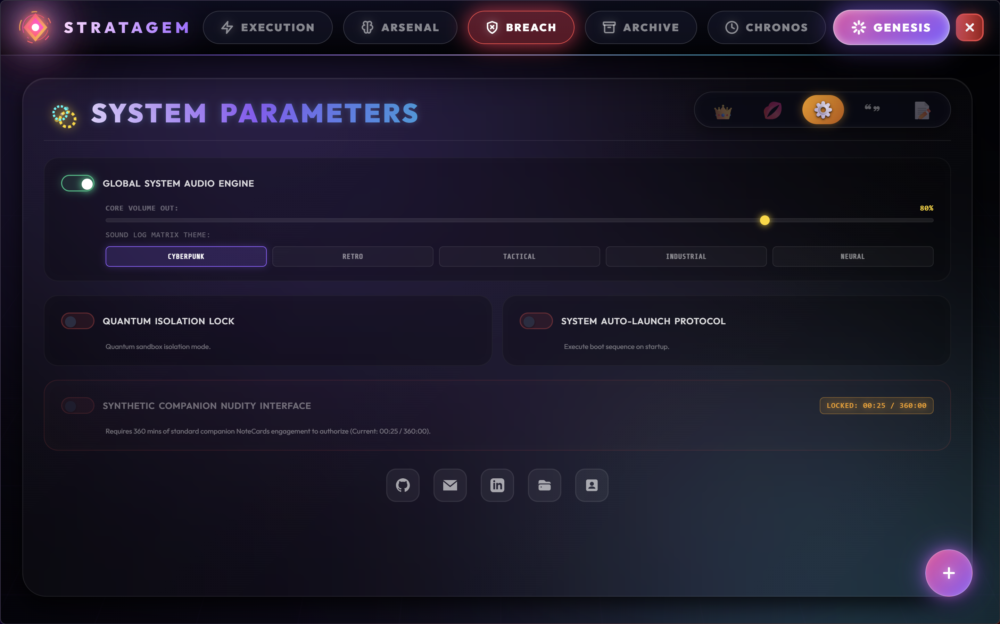
</p>

* **UI & Aesthetics**: Row lists with active green/red toggles and volumetric slides.
* **Function & Abilities**: Direct toggle controls for sound card activation, global telemetry sweeps, background gradient animations, and registry queries overrides.

---

### 24. INTEGRATED IMPROVEMENT MATRIX (Neural Uplink Logs)

<p align="center">
  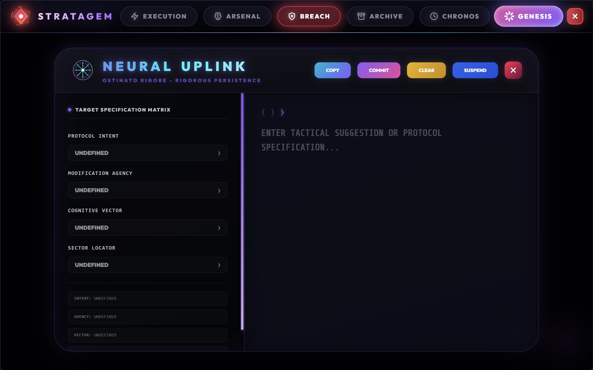
</p>
<br>
<p align="center">
  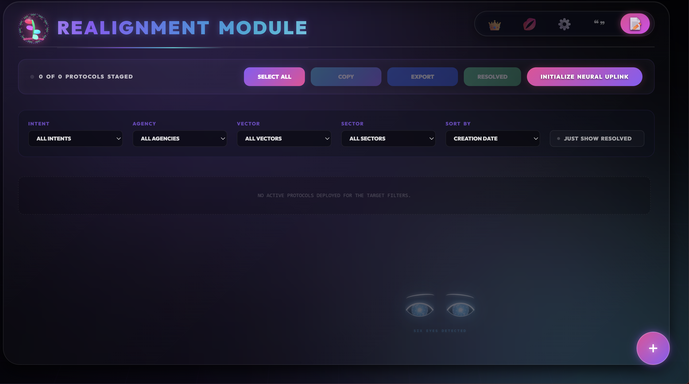
</p>

* **UI & Aesthetics**: Scrolling diagnostic log tracking recent configuration improvements and task calibrations.
* **Function & Abilities**: Pulls logs from the database configurations, tracking system-wide adjustments and calibrations.

---

## ⌨️ Tactical Operational Keyboard Protocols

Stratagem v3.0 introduces high-speed keyboard shortcuts for zero-mouse command terminal navigation:

| Keybinding | Operational Action | Telemetry Scope |
| :--- | :--- | :--- |
| **`Ctrl + Alt + S`** | **Cyber-Stasis Sleep / Resume** | Instantly dumps CPU to 0.0% & GPU load to 0% |
| **`Ctrl + K`** | **Universal Command Palette** | Fuzzy-search indexing across all active missions & sectors |
| **`J`** / **`K`** | **Row Selection Down / Up** | Vim-style linear task list navigation |
| **`Enter`** | **Open Mission Protocol** | Expands full telemetry & checklist view of selected mission |
| **`Space`** | **Toggle Objective Check** | Toggles subtask completion checkbox in active protocol |
| **`Esc`** | **Abort / Close Overlay** | Closes any active modal or returns focus to main dashboard |
| **`Win + M`** | **Auto-Stasis on Minimize** | Background power saver activated via Electron `powerMonitor` |

---

## 🏛️ Technical Specifications & Offline Sovereign Guarantee

Stratagem is engineered to function 100% offline with zero cloud telemetry or third-party server dependencies:

```text
┌──────────────────────────┬─────────────────────────────────────────────────┐
│ SYSTEM METRIC            │ SPECIFICATION                                   │
├──────────────────────────┼─────────────────────────────────────────────────┤
│ Target Operating System  │ Windows 10 / 11 (x64)                           │
│ Application Framework    │ Electron Native Frameless Kiosk Shell           │
│ UI & State Engine        │ Svelte 5 (Runes Reactivity System)              │
│ Local Database           │ SQLite3 with Write-Ahead Logging (WAL Mode)     │
│ Bundler & Toolchain      │ Vite + TypeScript + Native C++ Addons           │
│ Idle Resource Footprint  │ 0.0% – 0.1% CPU | 0 MB VRAM (Cyber-Stasis Mode) │
│ Data Privacy & Telemetry │ 100% Offline Sovereign — Zero Outbound Tracking  │
└──────────────────────────┴─────────────────────────────────────────────────┘
```

---

## 📚 Deep Documentation & Developer Artifacts

For operators, visual architects, and developers seeking internal blueprints:

- **[Architectural Evolution & Handoff to Campaigns (EVOLUTION.md)](EVOLUTION.md)**: Deep retrospective on cinematic UI, system resource realities, and the birth of Campaigns.
- **[Release 3.0.0 Flagship Notes (Release-3.md)](Release-3.md)**: Cyber-Stasis Protocol, 0% CPU/GPU sleep, and keyboard velocity.
- **[Release 2.0.0 & 2.3.0 Notes (Release-2.md)](Release-2.md)**: Svelte DOM unmounting (-60% RAM), WAL concurrency, and milestone click ratio.
- **[Release 1.0.1 Notes (Release-1.md)](Release-1.md)**: Initial production launch, 24-sector FUI layout, and NSIS installer.
- **[Operator Onboarding & Build Protocol (GUIDE.md)](GUIDE.md)**: Cloning walkthrough, C++ native rebuilds, and multi-platform compilation.
- **[Database Schemas & Preload APIs (INFO.md)](INFO.md)**: Full SQLite schema definitions, IPC ContextBridge contracts, and store maps.
- **[System Architecture Deep-Dive (docs/ARCHITECTURE.md)](docs/ARCHITECTURE.md)**: Deterministic state-machine principles and multi-source sync.
- **[Comprehensive Project Changelog (docs/changelog.md)](docs/changelog.md)**: Full chronological evolution from v1.0.1 through v3.0.0.
- **[Security Policy & Disclosure (SECURITY.md)](SECURITY.md)**: Coordinated vulnerability disclosure and supported versions matrix.
- **[Troubleshooting Runbook (docs/troubleshooting.md)](docs/troubleshooting.md)**: Database corruption recovery, WAL checkpoints, and audio clipping fixes.
- **[Engineering Credits (docs/credits.md)](docs/credits.md)**: Full maintainer and contributor attribution.

---

## ⚔️ Tactical Siblings: Campaigns Command Center & FastMCP Plugin

Looking for a lightweight daily task execution counterpart or AI agent integration?

* **⚔️ [Campaigns Command Center](https://github.com/karansinghverma979/Campaigns)**: The streamlined, sub-millisecond daily execution counterpart to Stratagem. While Stratagem serves as the cinematic macro-strategic life planning matrix, Campaigns focuses on daily strikes, milestone checkpoints, and dual-entry cash flow runways with near-zero RAM footprint.
* **🤖 [Antigravity Campaigns Plugin](https://github.com/karansinghverma979/antigravity-campaigns-plugin)**: Official FastMCP server allowing Google Antigravity and Claude agents to autonomously query, update, and manage campaigns and strikes in the background.

---

<div align="center">

# KARAN SINGH VERMA

### *IRRATIONAL FRENZY CONTROLLED BY REASON AND SELF REFLECTION.*

[](https://github.com/karansinghverma979)
[](https://karansinghverma979.github.io)

<br />

### 👥 Engineering Credits & Collaboration
**Lead Systems Architect & Creator:** [Karan Singh Verma](https://github.com/karansinghverma979)  
**Core Contributor & Documentation Engineer:** [Akarshan Gupta](https://github.com/Akarshan2006)

<br />

<p align="center">
  
  
  
  
  
</p>

---

*Classified Document — Authorization Level 4 Required — Stratagem Core Terminal*

</div>
