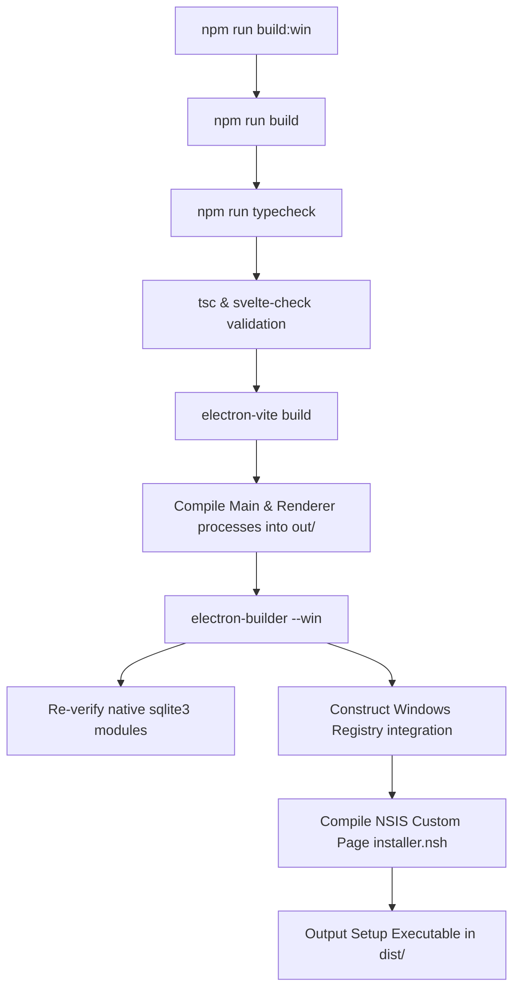

# STRATAGEM DEPLOYMENT PROTOCOL: WINDOWS STANDALONE PACKAGING (.EXE)

This document outlines the tactical execution plan to compile, bundle, and generate a self-contained executable installer (`.exe`) for the **Strategem 1.0** application.

---

## ⚡ QUICK START COMMANDS

To package the application quickly from a clean environment, execute these commands in sequence from your project root:

1. **Install Codebase Dependencies:**
   ```bash
   npm install
   ```
2. **Rebuild Native Modules (SQLite3 ABI Sync):**
   ```bash
   npm run postinstall
   ```
3. **Execute Production Compile & Package:**
   ```bash
   npm run build:win
   ```
4. **Locate Generated Installer:**
   Navigate to the `dist/` directory in the project root:
   - File: `dist/n0-furnace-1.0.1-setup.exe`

---

## 🛠️ THE BUILD PIPELINE EXPLAINED

When running `npm run build:win`, the system triggers the following automated build chain:



### Build Steps:
1. **Typecheck & Linting:** Runs TypeScript compiler checking (`tsc`) and Svelte integrity validation (`svelte-check`) to ensure compile-time code safety.
2. **Vite Compilation:** Compiles, bundles, and minifies the Svelte frontend and Svelte assets under `src/renderer/`, and compiles TypeScript files under `src/main/` and `src/preload/`, placing production-ready assets into the `out/` folder.
3. **Electron-Builder Packaging:**
   - Packages the application code into a secure, single-archive Svelte ASAR container (`app.asar`).
   - Copies necessary external files specified under the `extraResources` block of `electron-builder.yml`.
   - Executes the custom NSIS wizard compiler referencing `build/installer.nsh` to wrap the package in a Windows installer.

---

## 📁 KEY INTEGRATION & CUSTOM PATH PORTALS

**Strategem 1.0** uses a custom installation setup to persist external assets. During installation, the setup installer prompts the user with a **Custom Folder Configuration** window containing paths to three key directories:
1. **Developer Portraits Folder (`devImages`):** Default path: `%USERPROFILE%\Strategem\DeveloperImages`
2. **NoteCards Images Folder (`NoteCards`):** Default path: `%USERPROFILE%\Strategem\NoteCards`
3. **SQLite Database Folder:** Default path: `%APPDATA%\StrategemData`

### Registry Bindings
The custom NSIS installer writes these selected path configurations directly into the Windows registry at:
- **Registry Key Hive:** `HKEY_CURRENT_USER\Software\Strategem 1.0`
- **Registry Values (`REG_SZ` type):**
  - `DevImagesPath`
  - `NoteCardsPath`
  - `DatabasePath`

On boot, the main Electron process executes registry queries to locate the database (`stratagem_intel.db`) and user-facing assets dynamically.

---

## 🔍 TROUBLESHOOTING & COMMON BUGS

### 1. SQLite3 Native Module ABI Mismatch
* **Symptom:** The installer builds successfully and installs, but upon launch, the app crashes, fails to load dashboard telemetry, or displays a blank screen. The console log displays an error similar to:
  `Error: The module '\\?\...\node_modules\sqlite3\build\Release\sqlite3.node' was compiled against a different Node.js version...`
* **Root Cause:** Native C++ modules like `sqlite3` are tied to the local development environment's Node.js runtime ABI. When packaged into Electron, they must match Electron's internal Node.js runtime version ABI.
* **Tactical Fix:**
  - Run the postinstall script in the project root:
    ```bash
    npm run postinstall
    ```
    This triggers `electron-builder install-app-deps`, rebuilding all native modules specifically targeting the active Electron version.
  - If compiling fails, ensure your environment has Windows Build Tools installed. Open PowerShell as administrator and run:
    ```powershell
    npm install --global windows-build-tools
    ```
    *(Alternatively, install the **Desktop development with C++** workload via the Visual Studio Installer).*

### 2. Missing Extra Resources Build Failures
* **Symptom:** The packaging command terminates early with missing file path errors referencing `AIGirlPanel` or `devImages` assets.
* **Root Cause:** The `electron-builder.yml` lists hardcoded copy directives under `extraResources` which will fail the build if the directories are missing in the source code:
  - `src/renderer/src/sectors/Genesis/GenesisMain/AIGirlPanel/Nudity`
  - `src/renderer/src/sectors/Genesis/GenesisMain/AIGirlPanel/NoteCards/Cards`
  - `src/renderer/src/sectors/Genesis/GenesisMain/DeveloperPanel/devImages`
* **Tactical Fix:**
  - Verify that the directories exist inside the source files and are populated.
  - If these assets are not needed for a clean build, comment out or remove the corresponding lines from the `extraResources` array in [electron-builder.yml](file:///C:/Users/karan/Void/Stratagem/N0_Furnace/electron-builder.yml).

### 3. Microsoft SmartScreen "Unknown Publisher" Warnings
* **Symptom:** Windows blocks the installer, presenting a security warning: "Windows Defender SmartScreen prevented an unrecognized app from starting."
* **Root Cause:** The installer executable does not contain an authentic digital code-signing signature.
* **Tactical Fix:**
  - **Local Bypass:** Click the **"More Info"** link on the warning screen and select **"Run anyway"**.
  - **Production Release:** To eliminate this message entirely for end-users, configure a valid digital certificate inside [electron-builder.yml](file:///C:/Users/karan/Void/Stratagem/N0_Furnace/electron-builder.yml):
    ```yaml
    win:
      certificateFile: "path/to/certificate.pfx"
      certificatePassword: "YOUR_DECRYPT_PASSWORD"
    ```

### 4. Database/Registry Locks and Permissions
* **Symptom:** The app starts, but displays diagnostic logs, connection failures, or cannot save database records.
* **Root Cause:** The configuration paths pointing to `DatabasePath` in the registry point to restricted folders or locations with read-only permissions.
* **Tactical Fix:**
  - Launch the Windows Registry Editor (`regedit`).
  - Navigate to `Computer\HKEY_CURRENT_USER\Software\Strategem 1.0`.
  - Validate the value of the `DatabasePath` string.
  - Delete the registry key folder `Strategem 1.0` if you wish to reset configurations. The app will reconstruct missing registry entries using the default fallback path (`%APPDATA%\n0-furnace`).

---

## ⚡ PRE-FLIGHT VERIFICATION CHECKLIST

Ensure the following tasks are completed before compiling a release:
- [ ] Run typescript and validation tests to ensure compilation integrity: `npm run typecheck` compiles clean.
- [ ] Verify the version number in [package.json](file:///C:/Users/karan/Void/Stratagem/N0_Furnace/package.json) is updated to match your release target.
- [ ] Confirm no secrets, local developer testing credentials, or environment files are bundled (managed automatically by file exclusion rules `!` in `electron-builder.yml`).
